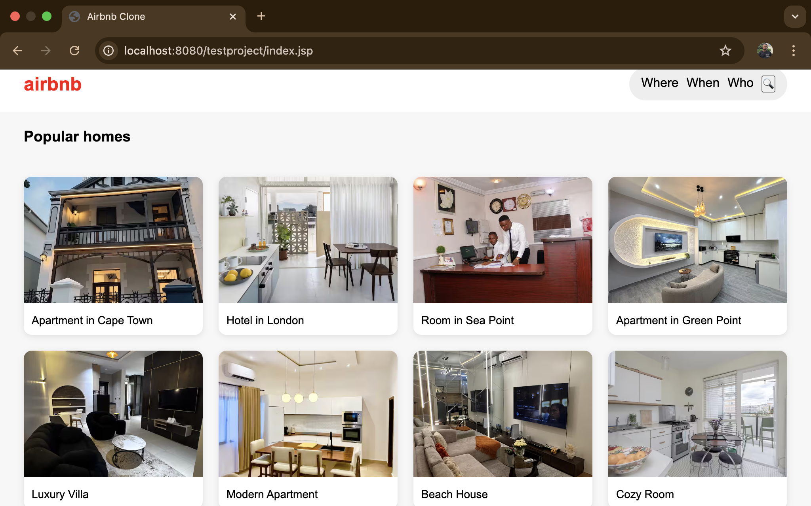
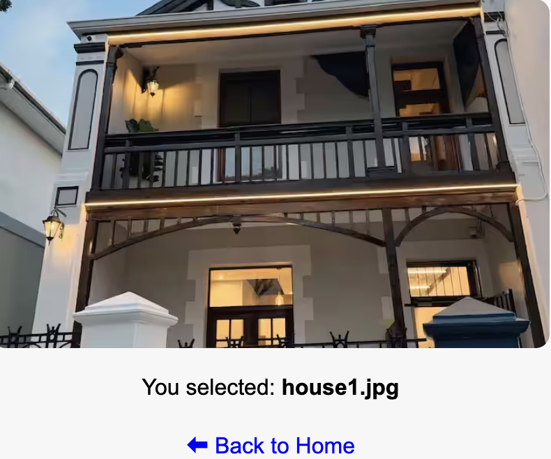

 🏡 AirbnbClone Project
 
   Description
This project is a simple Airbnb-style website built using 
JSP and CSS, It displays a collection of property images in a 
clean and responsive layout. Users can click on images to 
navigate through the site.

 🚀 Features
- Image gallery with 8 property listings  
- Clickable images for navigation  
- Responsive grid layout  
- Simple and clean user interface  

 📸 Screenshots
 Homepage View
The main interface showing all available property listings.

### Project Screenshots

 🛠️ Technologies Used 
- CSS  
- JSP  

👨‍💻 Author
Godspeare Johnson
 📌 Note
 
This project is for academic purposes and demonstrates
basic web development skills.
Thankyou for view this project.
